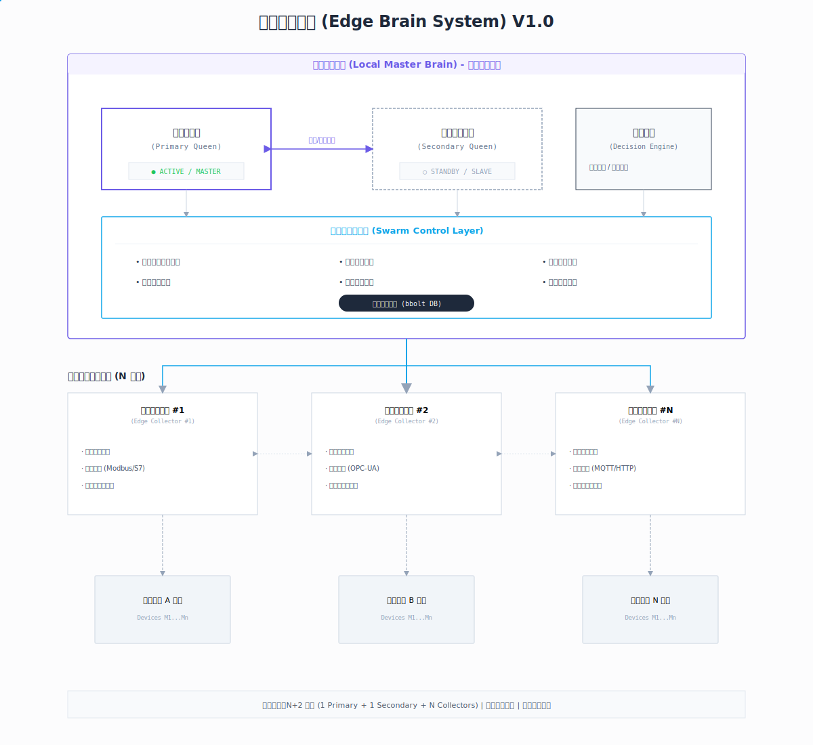
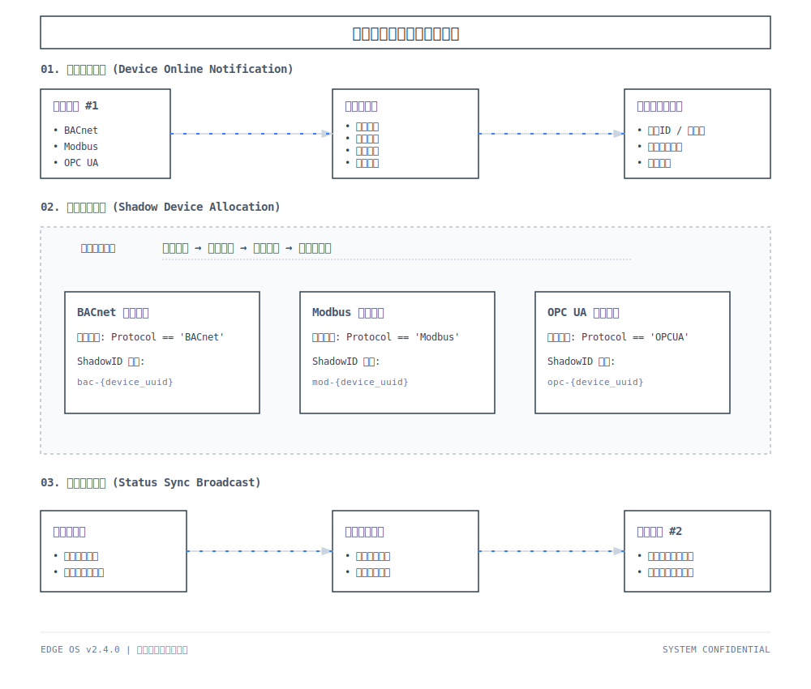
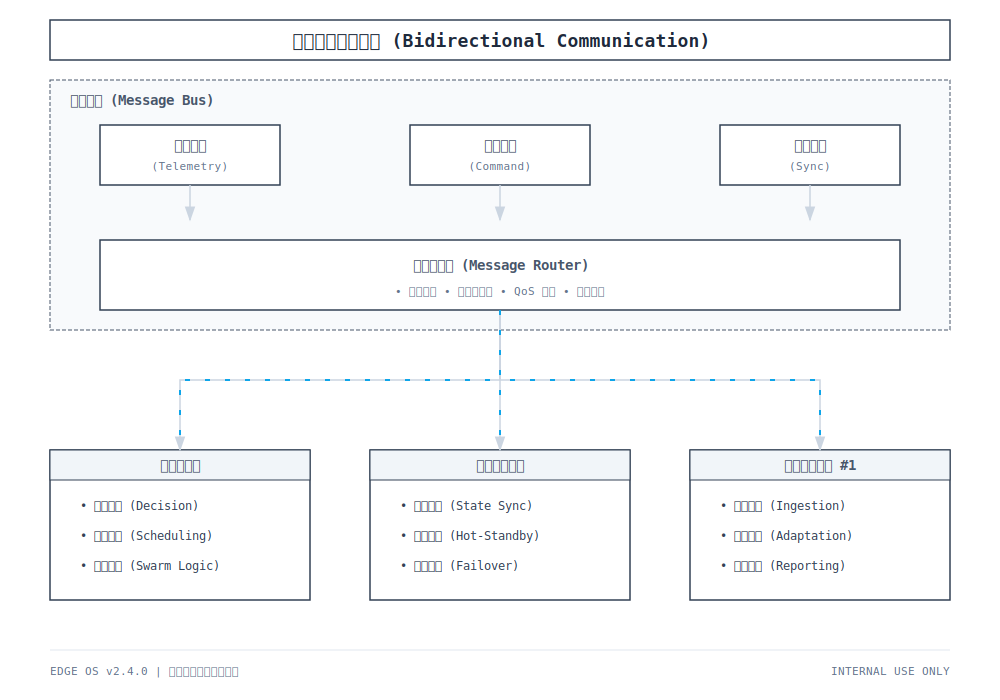
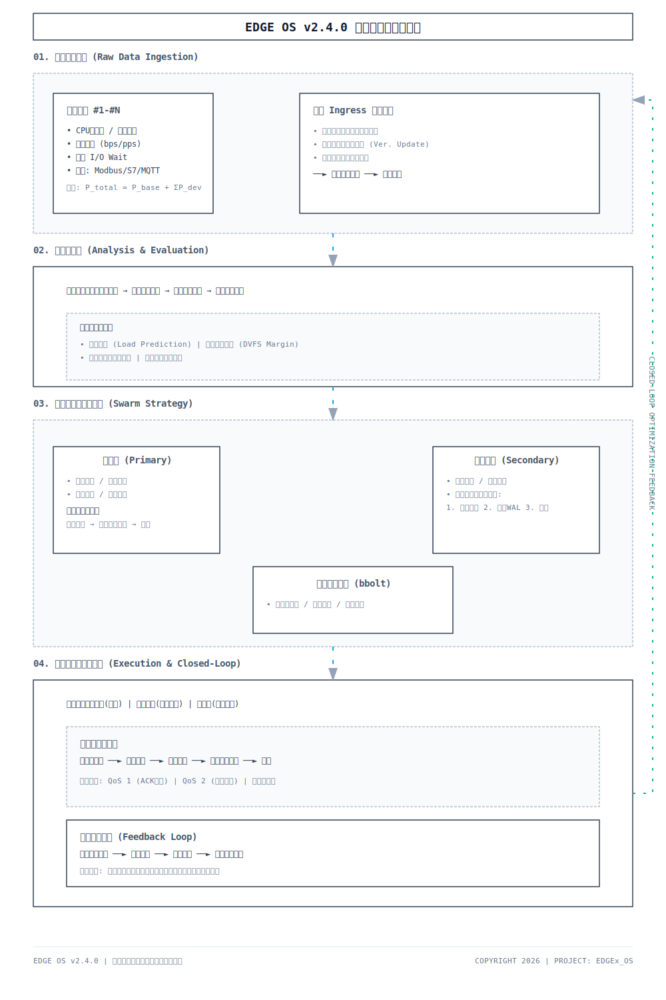
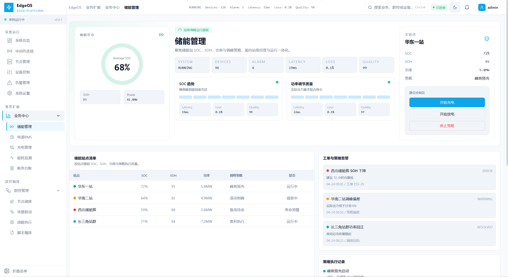
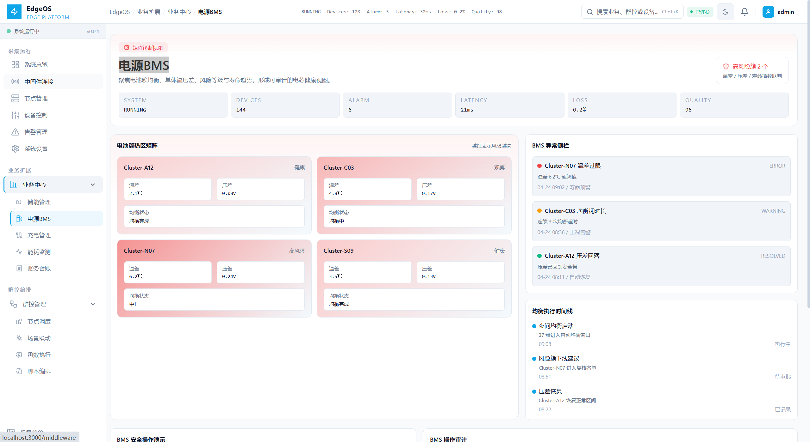
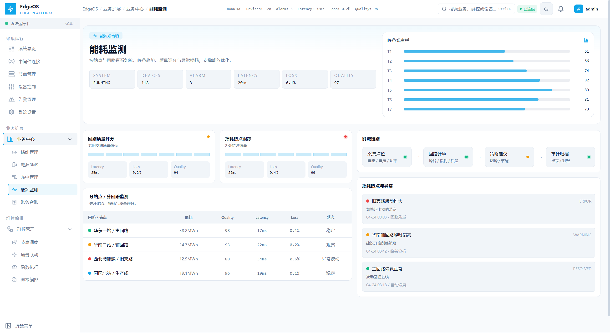
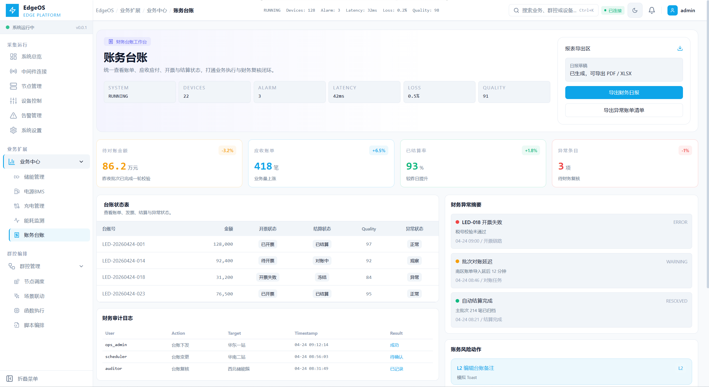
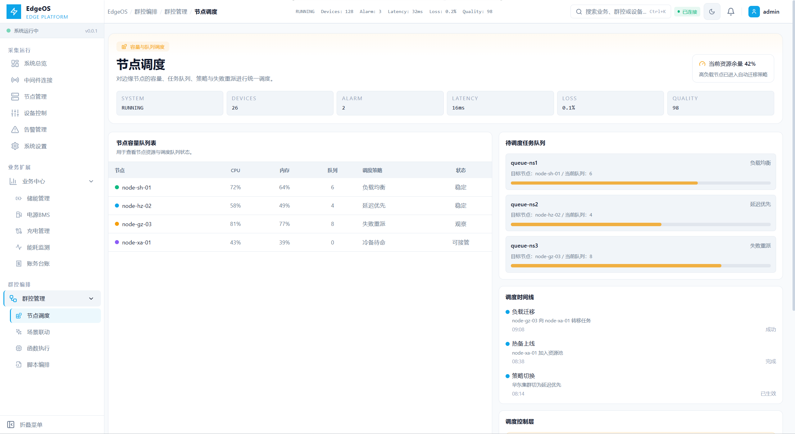
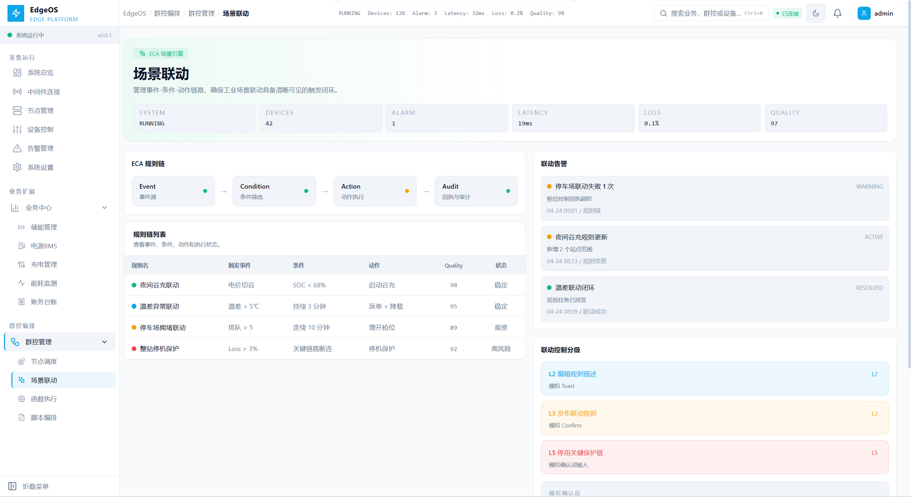

# EdgeOS 文档中心

EdgeOS 是面向工业边缘场景的“边缘大脑系统”，用于配合 EdgeX 边缘采集网关，构建具备 **N+2 冗余架构、群控调度、影子设备协同、业务运营扩展** 的工业级平台。

---

## 核心能力

### 1. 高可用边缘大脑

- N+2 冗余架构
- 主母皇 / 备用母皇双机热备
- 多边缘采集网关统一协调
- 故障检测与自动切换

  

### 2. 影子设备与双向通信

- 影子设备自动发现
- 跨边缘节点的设备注册与同步
- 上行遥测、事件、告警统一接入
- 下行控制、配置、任务分发能力

  

  

### 3. 群控与节能优化

- 群控算法调度
- 节点任务分配与负载均衡
- 业务策略执行
- 能耗优化与节能调度

  

---

## 前端能力现状

当前前端已完成从“采集运行层”向“业务中心 + 群控管理”两大域的扩展，支持 GitHub Pages 文档展示与 UI 规划沉淀。

### 业务中心

- 储能管理
- 电源BMS
- 充电管理
- 能耗监测
- 账务台账

  

  

  

  

### 群控管理

- 节点调度
- 场景联动
- 函数执行
- 脚本编排

  

  

---

## 文档导航

### 系统与协议

- [项目总说明](../readme.md)
- [EdgeOS 与 EdgeX 通信测试验证文档](./EdgeOS与EdgeX通信测试验证文档.md)
- [EdgeOS 与 EdgeX 通信测试报告](./EdgeOS_与EdgeX通信测试报告_20260417.md)
- [EdgeX 通信协议规范 (MQTT-NATS)](./EdgeX通信协议规范(MQTT-NATS).md)
- [EdgeOS 后端实现指南](./EdgeOS%20后端实现指南.md)

### UI 与前端规划

- [EdgeOS UI 规划文档](./EdgeOS%20UI规划文档.md)
- [EdgeOS 工业大脑 UI 开发实操指南](./样式规范.md)
- [EdgeOS 2026 P3 TODO](./EdgeOS-2026-P3-TODO.md)

---

## P3 扩展重点

P3 阶段重点是把前端从“采集接入平台”提升为“业务运营平台 + 群控编排平台”：

- 导航升级为一级分组 + 二级菜单
- 新增 11 个高仿真静态页面
- 所有页面统一展示 `Latency / Loss / Quality`
- 页面从统一模板升级为模块化、差异化独立编排
- 规划文档中已补齐技术实现路径与依赖关系

---

## 建议阅读顺序

1. [项目总说明](../readme.md)
2. [EdgeX 通信协议规范 (MQTT-NATS)](./EdgeX通信协议规范(MQTT-NATS).md)
3. [EdgeOS 后端实现指南](./EdgeOS%20后端实现指南.md)
4. [EdgeOS UI 规划文档](./EdgeOS%20UI规划文档.md)
5. [EdgeOS 工业大脑 UI 开发实操指南](./样式规范.md)
6. [EdgeOS 2026 P3 TODO](./EdgeOS-2026-P3-TODO.md)
