# 边缘大脑系统 (Edge Brain Open System) 

> 本项目是为配合 [Industrial Edge Gateway (edgeCore)](https://github.com/anviod/edgeCore) 项目而实现的边缘大脑系统，提供 N+2 冗余架构、蜂群模式与集群协调能力。核心新增 **EAN (Edge Agent Network)** 统一 Agent 协作层，实现跨边缘网关的能力发现、调用编排与事件流处理。

<div align="center">
  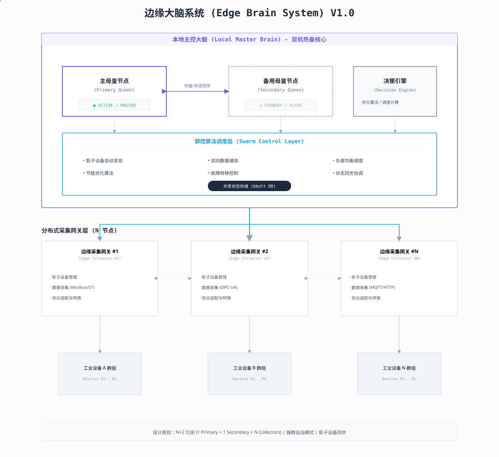
</div>

## 快速开始

### 环境要求

- Go 1.21+
- Node.js 18+
- npm 9+

### 后端服务

```bash
cd server
go mod tidy
go run main.go
```

后端默认运行在 `http://localhost:8080`。

### 前端开发

```bash
cd ui
npm install
npm run dev
```

前端开发服务器运行在 `http://localhost:5173`，API 请求通过 `/api` 前缀自动代理到 `http://localhost:8080`。

构建生产版本：

```bash
npm run build
```

## EAN 2.0 核心功能

**Edge Agent Network (EAN) 2.0** 在现有 edgeCore + EdgeOS 架构上增加统一 Agent 协作层：

- **edgeCore**：Capability Runtime（能力注册、发现发布、Invoke 执行、Event 上报）
- **EdgeOS**：Coordination Platform（全局发现索引、跨节点编排、Invoke 发起、Event 订阅与规则）

协议层统一为 `Agent / Capability / Discovery / Invoke / Event`，传输同时支持 **MQTT** 与 **NATS**，Topic 使用统一的 `$edgeos/...` 逻辑命名（MQTT 斜杠形式；NATS 映射为点分 Subject，`/`→`.`、`+`→`*`、`#`→`>`）。

### Discovery 发现中心

全局 Agent 与 Capability 索引，订阅 edgeCore 北向 EAN Runtime 发布的发现消息：

- **Agent 上线/下线**：自动维护在线 Agent 列表，支持 `discovery/agent` 与 `discovery/agent/offline`
- **Capability 注册**：按 `agent_id` 聚合 Capability 列表，支持 driver / system / ai / workflow 类别
- **主动查询**：启动后周期性 Query edgeCore 完整 Capability，确保索引完整
- **V1 Bridge 隔离**：Phase 4（OS-P4）已下线 V1→EAN Bridge；V1 命令面已全面下线（`v1_command_enabled=false`）；`AttachRegistryMirror` 仅镜像北向原生 EAN Agent，transient/v1-bridge 测试 Agent 不污染 `/api/nodes`
- **前端 UI**：`EanAgentsView` 展示 Agent 列表、状态、Capability 详情

<div align="center">
  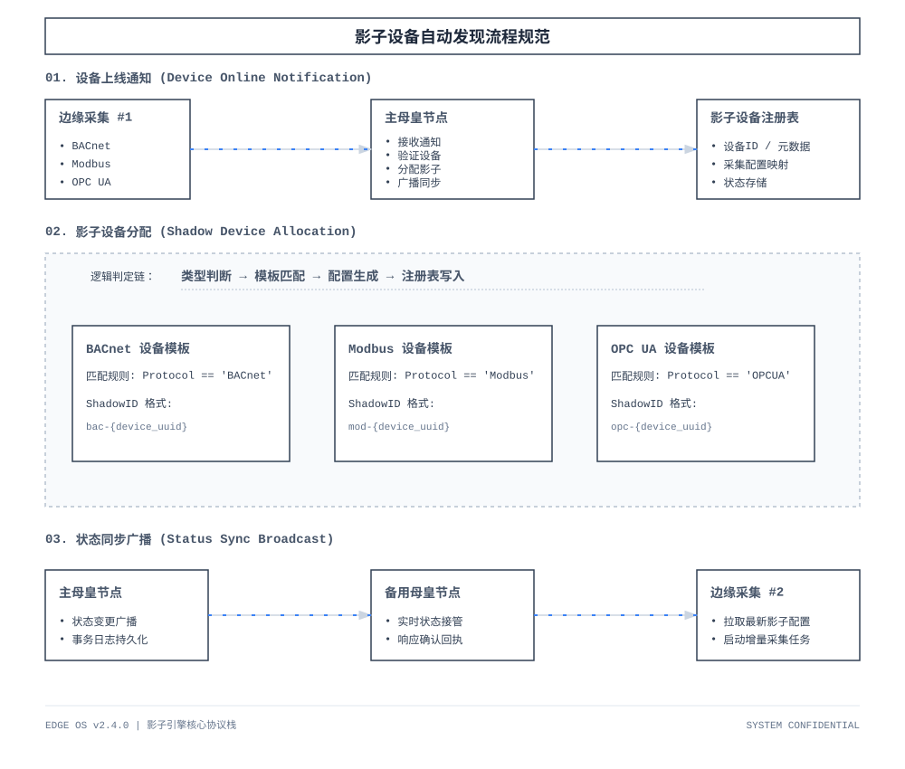
</div>

### Invoke 调用编排

跨 Agent 能力调用编排器，实现分布式能力调用闭环：

- **请求发布**：向 `$edgeos/invoke/{agent_id}` 发布 `invoke_capability` 信封
- **响应关联**：通过 `$edgeos/reply/{source}` 接收回复，`correlation_id` + `invoke_id` 双键关联
- **超时重试**：按 Capability `timeout_sec` 设置客户端超时，`invoke_id` 幂等
- **状态追踪**：可选订阅 `$edgeos/invoke/{agent_id}/status` 获取执行进度
- **前端 UI**：`EanInvokeView` 提供 Capability 选择、参数填写、执行结果展示

**默认 Capability 清单**：

| Capability ID | 类别 | 说明 |
|---------------|------|------|
| `{protocol}.read_points` | driver | 读取点位（modbus-tcp/rtu、opcua、bacnet、s7 等） |
| `{protocol}.write_point` | driver | 写入点位 |
| `{protocol}.scan_devices` | driver | 扫描设备 |
| `system.diagnostics` | system | 系统诊断 |
| `ai.protocol_reverse` | ai | 协议逆向（AI 分析） |
| `ai.doc_parse` | ai | 文档解析（AI 分析） |

<div align="center">
  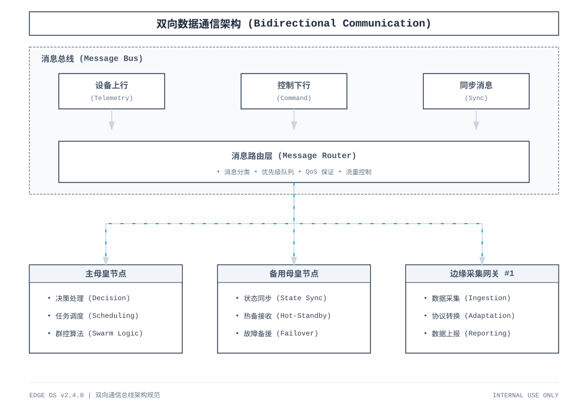
</div>

### Event 事件流

订阅并处理 edgeCore 上报的事件流，支持点位变化追踪：

- **点位变化**：`event_type={point_id}.changed`，携带 `value` 与 `previous_value`
- **设备在离线**：`device.online` / `device.offline` 事件
- **规则路由**：按 agent / device / point / event_type 过滤并触发规则/告警
- **广播订阅**：支持 `$edgeos/event/broadcast` 全局事件
- **前端 UI**：`EanEventsView` 实时展示 Event 流，含 previous_value 差量对比

<div align="center">
  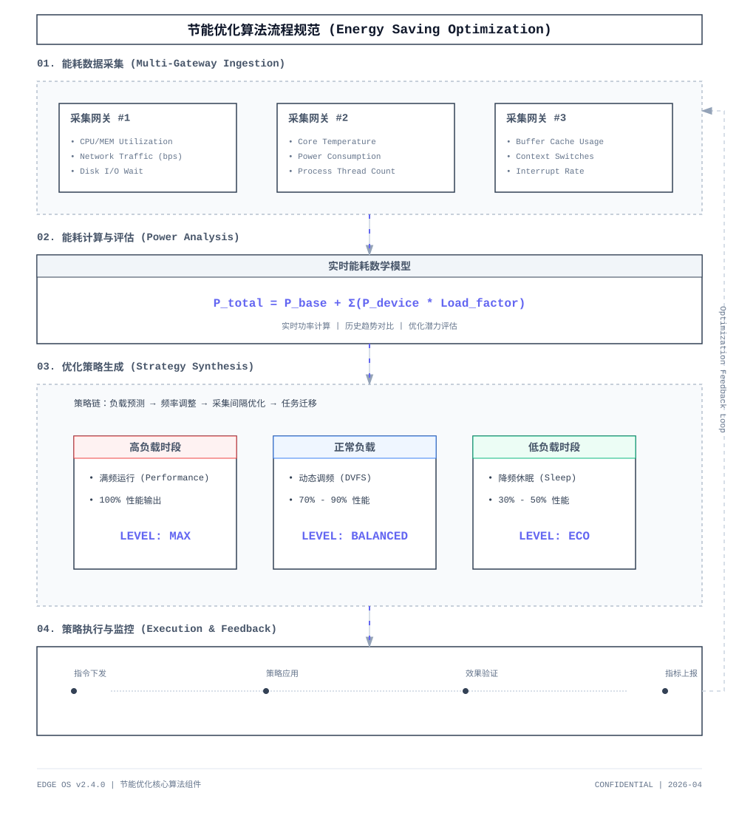
</div>

### Heartbeat 心跳监控

Agent 心跳接收与超时判定：

- 接收 `$edgeos/heartbeat/{agent_id}` 消息，记录最后存活时间与序列号
- 超时判定：超过 `N * heartbeat_interval_sec` 未收到心跳标记 offline
- 与 `discovery/agent/offline` 语义一致，确保状态同步

### Governance 平台治理

- **Agent 生命周期**：online / offline / heartbeat 超时判定（建议 2-3 个心跳周期）
- **权限控制**：按租户/项目限制可 Invoke 的 Capability，write / admin / AI 类能力默认受限
- **审计记录**：内存环形缓存记录跨节点 Invoke 的 initiator、target、capability、结果

### DualTransport 双传输

MQTT 与 NATS 对称传输，同一业务逻辑复用编解码，仅替换 transport adapter：

| 能力 | MQTT | NATS |
|------|------|------|
| Discovery | `$edgeos/discovery/*` | `$edgeos.discovery.*`（点分 Subject） |
| Invoke + Reply | `$edgeos/invoke/{id}` | `$edgeos.invoke.{id}` |
| Event | `$edgeos/event/{id}` | `$edgeos.event.{id}` |
| Heartbeat | `$edgeos/heartbeat/{id}` | `$edgeos.heartbeat.{id}` |

> NATS 使用标准点分 Subject，与 MQTT 斜杠 Topic 语义对称：`/`→`.`、`+`→`*`、`#`→`>`（如 `$edgeos/discovery/agent` → `$edgeos.discovery.agent`）。

- **启动韧性**：EAN 启用但 broker 不可用时 Warn + 后台重连 + 延迟订阅，不 fatal
- **V1 兼容并行**：EAN `$edgeos/*` 与 V1 `edgeCore/*`（MQTT）/`edgeCore.*`（NATS）同时可用，新功能只走 EAN

<div align="center">
  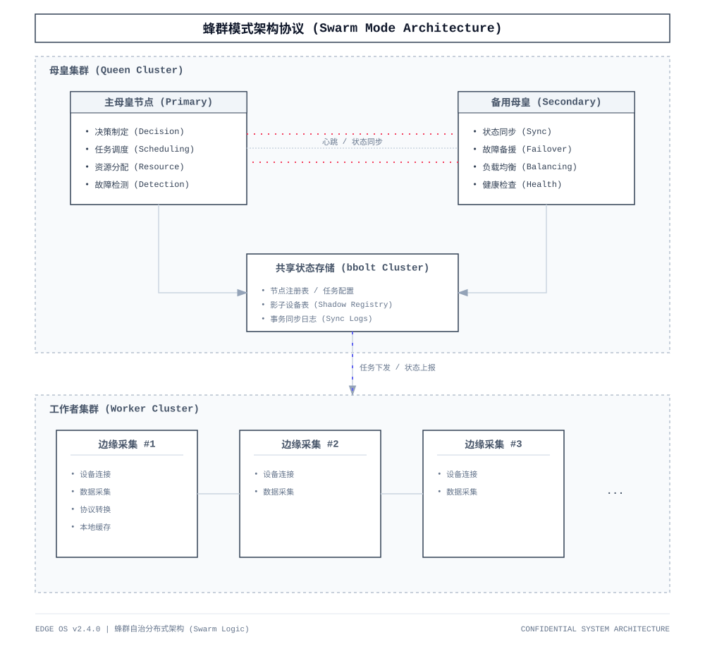
</div>

### AI Capability

AI 协同组件通过 EAN 网络暴露为可调用的 Capability：

- `ai.protocol_reverse`：协议逆向分析，输入 pcap/协议样本，输出候选配置
- `ai.doc_parse`：协议文档解析，自动生成点位映射建议
- **Human-in-the-loop**：AI 产出须人工 Confirm 后落库，禁止自动写配置
- `ai.protocol_reverse` / `ai.doc_parse` Invoke 返回 `task_id` + `deliverables`，支持 `wait=true` 阻塞等待

<div align="center">
  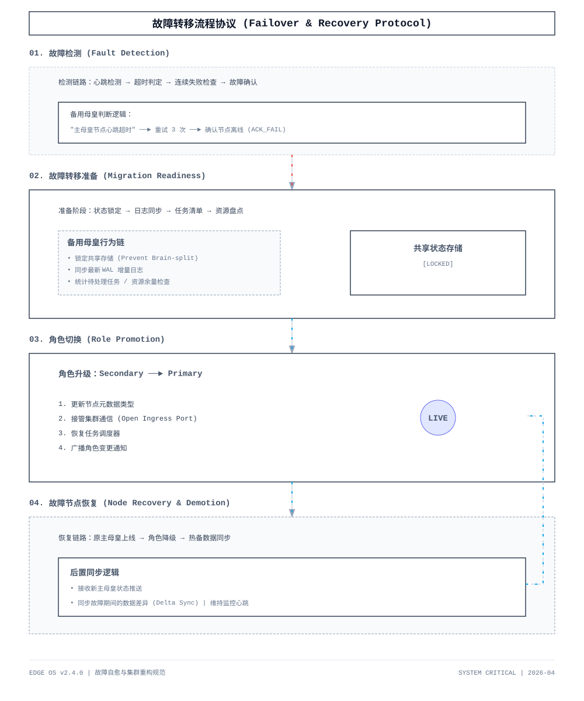
</div>

### 消息共享与集群协同

<div align="center">
  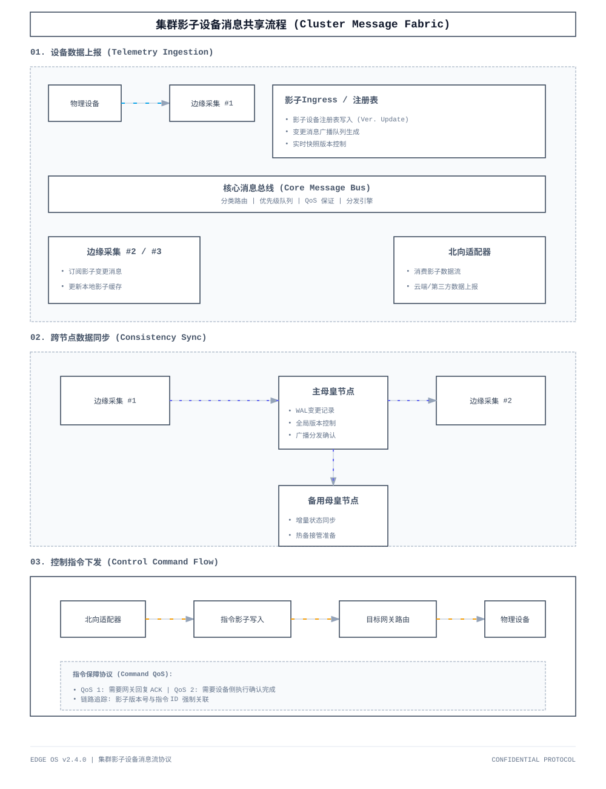
</div>

## 系统架构

### N+2 冗余架构

系统采用 N+2 冗余架构，由 N 个边缘采集网关、1 个主母皇节点和 1 个备用母皇节点组成：

| 组件 | 数量 | 职责 |
|------|------|------|
| 边缘采集网关 (Edge Collector) | N | 设备连接、数据采集、协议转换、EAN Capability Runtime |
| 主母皇节点 (Primary Queen) | 1 | 全局调度、决策制定、状态同步、EAN Coordination Platform |
| 备用母皇节点 (Secondary Queen) | 1 | 实时同步主节点状态，故障时自动切换 |

<div align="center">
  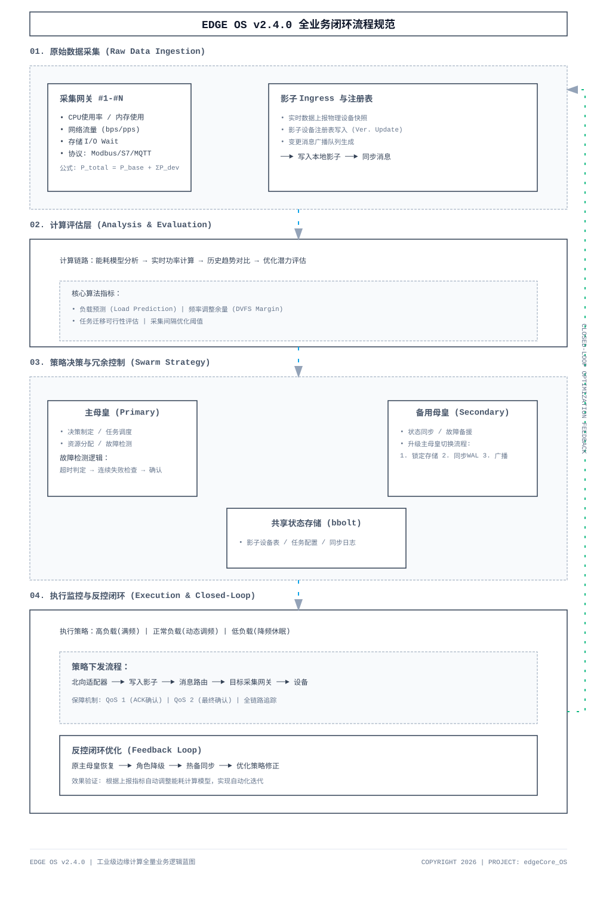
</div>

### 设计原则

- **高可用性**：N+2 冗余，确保系统持续运行
- **可扩展性**：支持横向扩展，适应不同规模部署
- **实时性**：毫秒级响应，满足工业现场需求
- **一致性**：分布式环境下数据一致性保证
- **自愈性**：故障自动检测和恢复

## 前端功能预览

前端已完成从"采集接入层"向"业务运营层 + 群控编排层"的扩展，新增 **EAN 管理** 一级导航：

**导航结构**：
- 采集运行（系统总览、消息总线、节点管理、设备控制、告警管理、系统设置）
- EAN 管理（总览、Agent 管理、Invoke 执行、Event 流、调试帮助）
- 业务扩展（储能管理、电源BMS、充电管理、能耗监测、账务台账）
- 群控编排（节点调度、场景联动、函数执行、脚本编排）

> 储能管理 - 站级调峰、SOC/SOH、充放电功率、站点策略面板

<div align="center">
  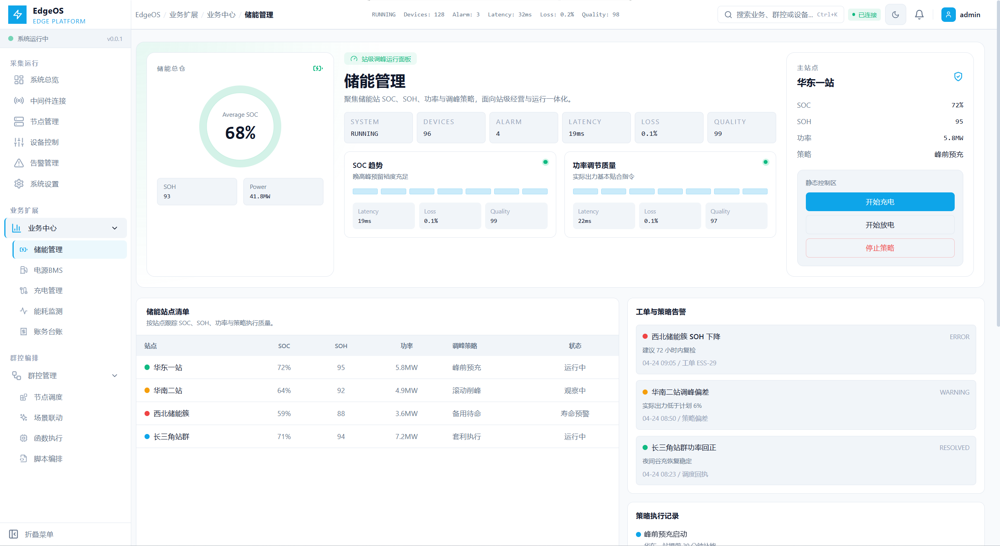
</div>

> 电源BMS - 电池簇矩阵诊断、温差压差、均衡状态、寿命风险

<div align="center">
  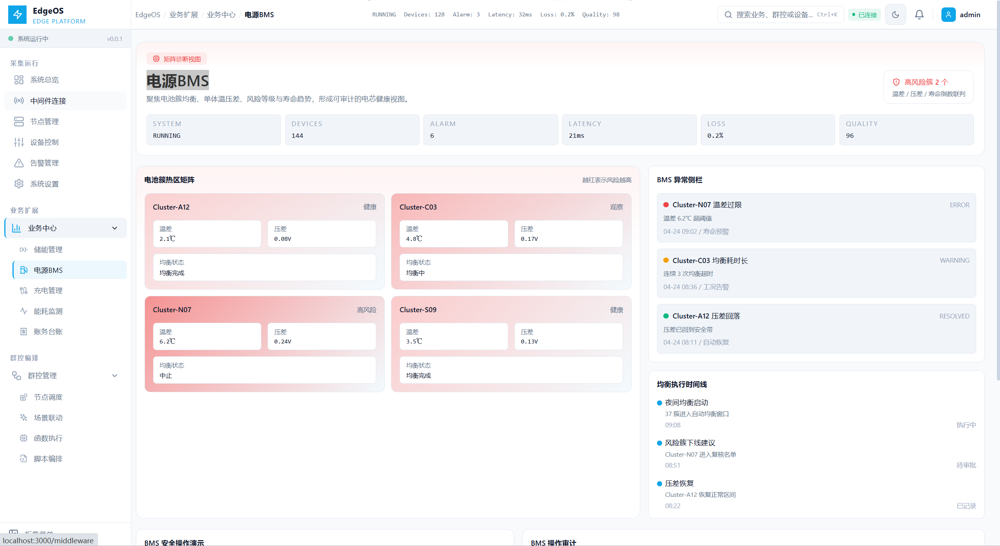
</div>

> 能耗监测 - 分回路能流、峰谷趋势、异常波动、损耗热点

<div align="center">
  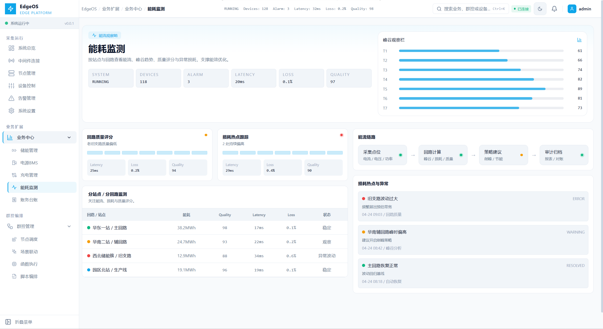
</div>

> 账务台账 - 账单、开票、结算、对账与报表导出

<div align="center">
  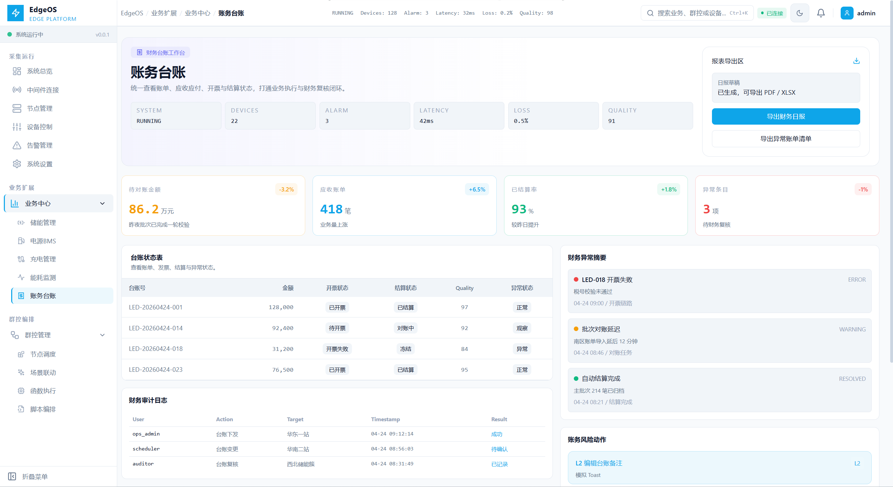
</div>

> 场景联动 - ECA 规则链、触发条件、动作编排、联动日志

<div align="center">
  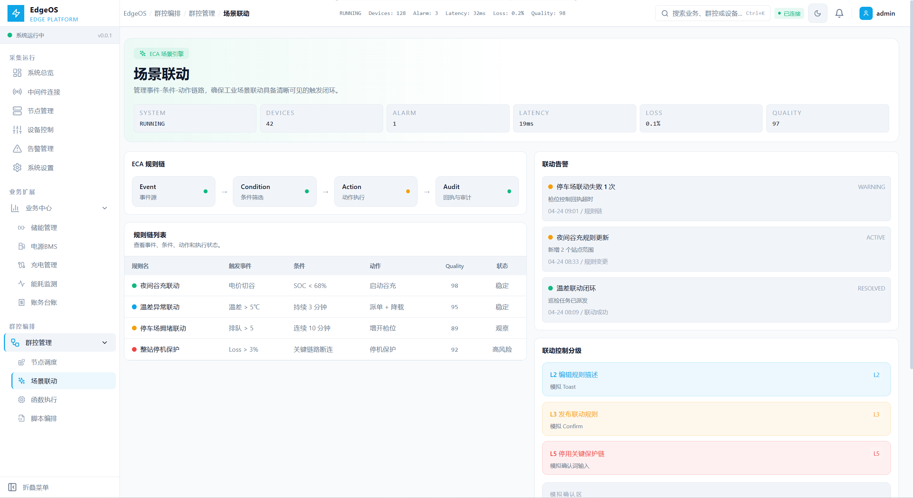
</div>

### 相关文档

- EAN 2.0 改造指南：[docs/edgeos/EAN2.0-edgeCore-EdgeOS改造指南.md](./docs/edgeos/EAN2.0-edgeCore-EdgeOS改造指南.md)
- EAN 2.0 升级报告：[docs/edgeos/EdgeOS-EAN2.0改造升级报告.md](./docs/edgeos/EdgeOS-EAN2.0改造升级报告.md)
- P3 规划文档：[docs/EdgeOS-2026-P3-TODO.md](./docs/EdgeOS-2026-P3-TODO.md)
- UI 样式规范：[docs/样式规范.md](./docs/%E6%A0%B7%E5%BC%8F%E8%A7%84%E8%8C%83.md)

## 前端最佳实践

### 组件开发

- 工业组件置于 `ui/src/components/edge/`，布局组件置于 `ui/src/components/layout/`，EAN 组件置于 `ui/src/components/eane/`
- 状态指示统一使用 `StatusIndicator`，危险操作使用 `DangerDialog` 二次确认
- 实时数值使用 `MetricCard`，数据表格使用 `DataTable`

### 样式规范

- 遵循工业级 UI 标准：直角设计、无阴影、高对比度配色
- 触控目标最小 44px，适配工业手套操作
- 参考 [样式规范.md](./docs/样式规范.md)

### 路由与认证

- 新增页面在 `ui/src/router/` 注册，受保护路由设置 `requiresAuth: true`
- API 请求通过 `ui/src/api/` 封装模块调用，自动处理 JWT Token 和错误响应

## 配套措施

### EAN 2.0 传输与协议

| 配套措施 | 描述 | 实现方式 |
|----------|------|----------|
| 双传输对称 | MQTT 斜杠 Topic + NATS 点分 Subject（`/`→`.`）语义对称 | `DualTransport` 统一编解码 |
| 消息序列化 | 高效数据编解码 | JSON 信封 + Protobuf |
| QoS 保证 | Discovery/Invoke/Event QoS1 | 持久化 / ACK / 重试 |
| 启动韧性 | Broker 不可用时后台重连 | Warn + 延迟订阅 |
| V1 兼容 | 过渡期并行运行 | `edgeCore/*` 保留，新功能走 `$edgeos/*` |
| 设备对账 | V1 全量上报剪枝 | `ReconcileDevices` upsert + 删除残留 |

### N+2 冗余架构

| 配套措施 | 描述 | 实现方式 |
|----------|------|----------|
| 心跳检测 | 节点存活状态检测 | TCP 心跳 / UDP 广播 |
| 故障检测 | 故障节点自动识别 | 超时检测 / 连续失败 |
| 角色切换 | 主备节点自动切换 | 热备 / 状态同步 |
| 数据同步 | 主备数据实时同步 | WAL / 增量同步 |
| 脑裂预防 | 避免双主同时服务 | 分布式锁 / 租约 |
| 故障恢复 | 故障节点重新加入 | 数据同步 / 配置恢复 |

## 实现路径

### 阶段一：核心框架

建立 N+2 冗余架构核心框架：节点角色定义与状态机、主备心跳检测、基本故障转移、共享状态存储层 (bbolt)、节点注册与发现。

### 阶段二：EAN 2.0 协调层（已完成）

实现 Edge Agent Network 2.0 完整协调层：

- **Discovery**：双传输订阅 `$edgeos/discovery/*`，建立 Agent/Capability 全局索引（实机：1 Agent / 63 Capability）
- **Invoke + Reply**：`system.diagnostics` / `modbus_tcp.list_points` 调用 completed，correlation_id 关联
- **Event + previous_value**：代码完成，实机 Event 流有点位变化数据
- **Heartbeat + Governance**：Agent 超时标记 offline，权限限制 write/admin/AI，审计内存缓存
- **V1 兼容 + 设备对账**：`ReconcileDevices` 修复 V1 上报残留（4=4），EAN Agent 同步节点注册表
- **Phase 4（v8/v9）**：V1→EAN Bridge 下线；`edgeCore/cmd/responses/#` 移除；**V1 命令面全面下线**（`v1_command_enabled=false`，命令统一 EAN Invoke）；`AttachRegistryMirror` 过滤 transient Agent——`/api/nodes` 仅含真实节点

**里程碑**：EAN 2.0 Phase 1/2 代码完成并实机复验通过（MQTT + NATS）；Phase 4 全量落地（OS-P4 / EX-P4）+ V1 命令面全面下线；全量 `go test ./...` 通过；UI build 通过。

### 阶段三：双向通信深化

- 实现 `$edgeos/state/*` 全量/增量状态同步
- Invoke status 进度订阅（OS-13）
- 审计持久化存储
- 双传输 Invoke 双边执行去重

### 阶段四：群控算法与节能优化

实现群控调度和节能优化：采集任务调度器、负载均衡算法、节能优化策略、动态频率调整、自适应采集间隔。

**里程碑**：采集任务智能调度；系统能耗降低 20-30%；负载均衡效果显著。

## 总结

本方案设计了一个功能完善的边缘大脑系统，采用 N+2 冗余架构模式，实现了一个主母皇节点和一个备用母皇节点的双机热备机制（蜂群模式）。系统能够协调 N 个边缘采集网关程序，实现影子设备自动发现、双向数据通信、群控算法调度以及节能优化等核心功能。

**EAN 2.0** 作为核心新增能力，在现有 edgeCore + EdgeOS 架构上增加了统一的 Agent 协作层，实现了跨边缘网关的能力发现、调用编排与事件流处理，支持 MQTT/NATS 双传输对称、V1 兼容并行、AI Capability 集成，为工业互联网和边缘计算场景提供了坚实的分布式协作基础。

## License

GPL-3.0
